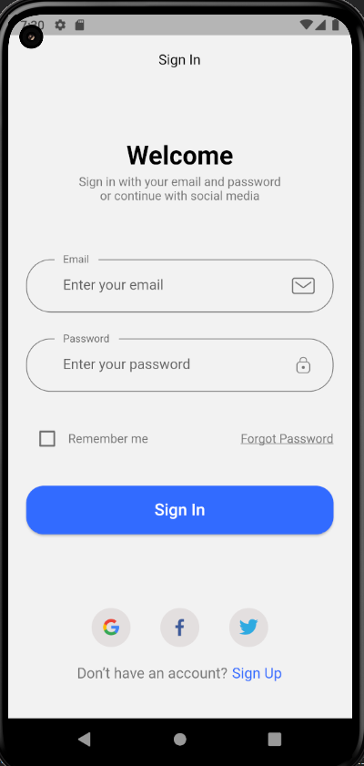
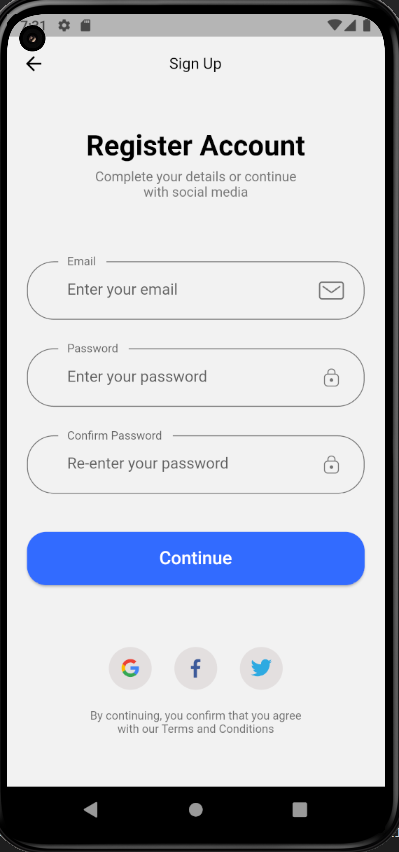
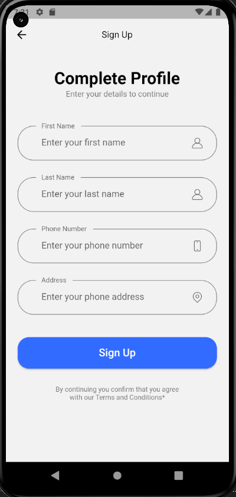
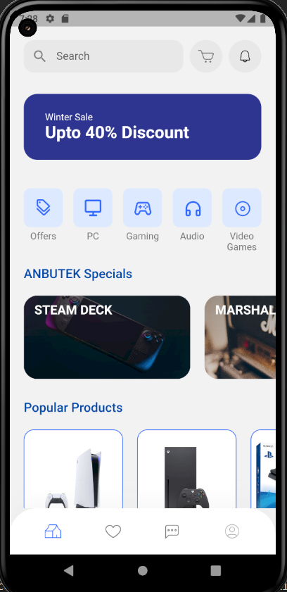
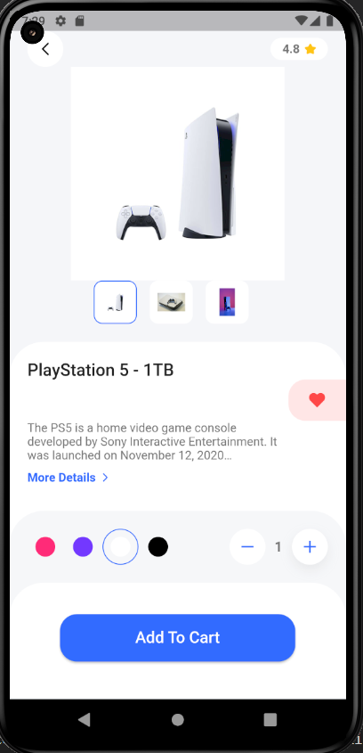
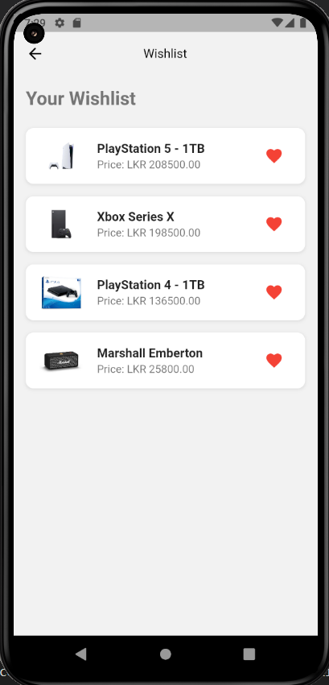

# ANBUTEK - Gaming & Audio Store

A Mobile Application designed and developed using Figma, Dart/Flutter & Firebase.

## About the App

The ANBUTEK Mobile App is your ultimate destination for gaming and audio products. This sleek and user-friendly mobile app is designed to make your shopping experience more enjoyable and convenient.

### Screenshots
| Sign In | Sign Up | Complete Profile |
|---------|---------|------------------|
|  |  |  |

| Home | Product View | Wishlist |
|------|--------------|----------|
|  |  |  |

## Key Features

- **Explore Products**: Discover a range of gaming and audio gear.
- **Effortless Shopping**: Easily add items to your cart and complete your purchases.
- **Customer Support**: Reach out to our support team for quick assistance.
- **View Profile**: Manage your profile and preferences with ease.
- **Add to Wishlist**: Create a wishlist of your favorite items for future reference.

## Conclusion

The ANBUTEK Mobile App is your pocket-sized gateway to the world of gaming and audio products. Whether you're a gamer, audiophile, or tech enthusiast, this app has you covered. Enjoy a seamless shopping experience, stay up-to-date with your orders, and discover exciting products. Get ready to level up your gaming and audio experience with ANBUTEK!

Happy shopping!
